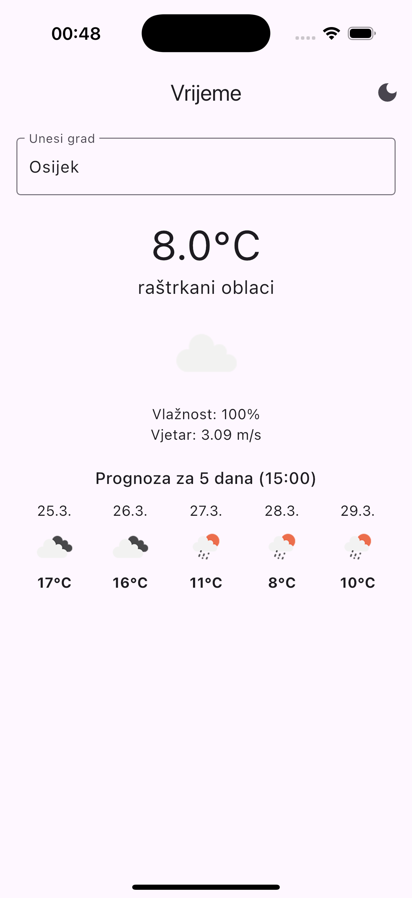

# 🌦 WeatherApp

WeatherApp is a Flutter-based weather application for iOS that provides current weather conditions and a 5-day forecast at 15:00 for any entered city. It features offline support, dark/light mode toggling, and a smooth user experience using animations and error handling.

## 📱 Screenshots

| Light Mode | Dark Mode |
|-----------|-----------|
|  |  |

## 🚀 Features

- 🌍 Search weather for any city
- 🌡 Real-time temperature, humidity, wind speed
- 📅 5-day forecast at 15:00
- 🌓 Toggle between Light and Dark Mode
- 💾 Remembers last searched city (SharedPreferences)
- 📴 Works offline with cached data
- ⚠️ Friendly error messages and retry button

## 🛠 Tech Stack

- **Flutter** with Provider (MVVM architecture)
- **OpenWeatherMap API**
- **SharedPreferences** for persistence
- **http** for networking
- **Flutter Launcher Icons**
- Designed with Material 3

## 🧪 How to Run

```bash
flutter pub get
flutter run
```

To build for iOS:
```bash
flutter build ios --release
```

Make sure to set up signing in Xcode for deployment on a real device.

## 📂 Folder Structure

```
lib/
├── models/
├── services/
├── viewmodels/
├── views/
└── main.dart
```

---

## 📌 Note

API key is currently hardcoded for demo purposes. Please do not abuse. In production, consider using secure storage or `.env` with `flutter_dotenv`.
